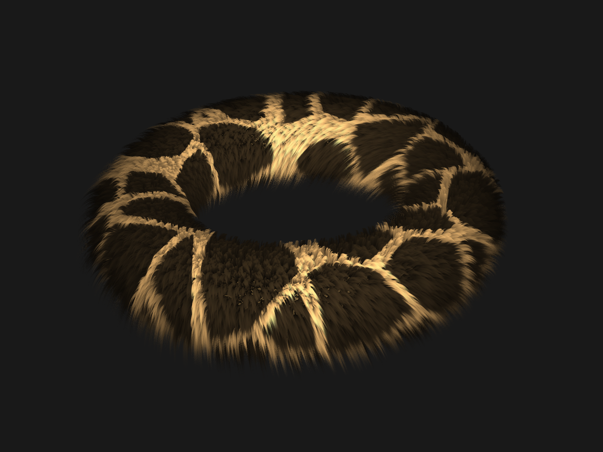

# Rendering of Volumetric Fur

An implementation in C++ and OpenGL of the Shells method for rendering of procedurally generated volumetric fur. AntTweakbar has been implemented to alow the user to fiddle with the furs properties.

## Compiling & Running

The provided Makefile only supports Mac OS X

In terminal: Compile with ``make`` and run the program with ``make run``

## Dependencies:

* GLM
* AntTweakbar
* Glfw
* Glew
* libpng

# Acknowledgements

A big thank you to my course examiner Stefan Gustavson, for the GLSL implementations of simplex and worley noise.